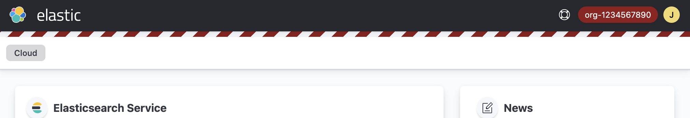

# userscript-elastic-cloud-visual-organization-indicator

## Install
* [Install Tampermonkey](https://www.tampermonkey.net/) or any other userscript manager
* [Install userscript](https://github.com/qoomon/userscript-elastic-cloud-visual-organization-indicator/raw/main/elastic-cloud-visual-organization-indicator.user.js)
